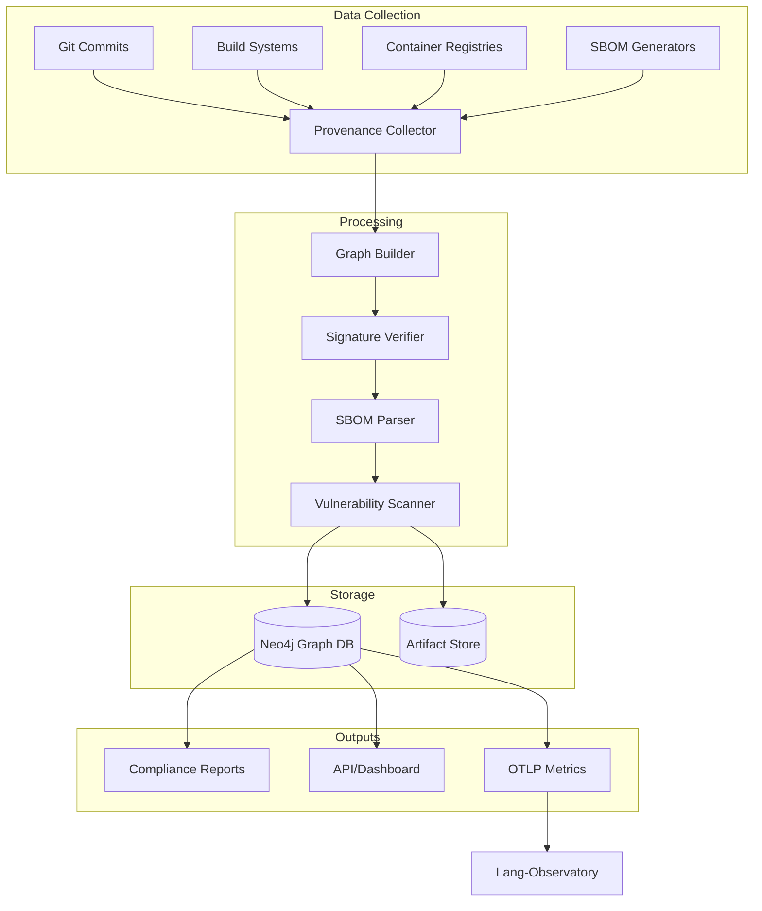

# provenance-graph-sbom-linker

[](https://github.com/your-org/provenance-graph-sbom-linker/actions)
[](LICENSE)
[](https://golang.org/dl/)
[](https://slsa.dev)

End-to-end software supply chain provenance tracker. Links source commits → build artifacts → container images → deployed AI models with cryptographic attestation. NIST SSDF and EU CRA compliant.

## 🎯 Key Features

- **Complete Provenance Graph**: Track code from commit to production
- **SBOM Integration**: Parse and link CycloneDX, SPDX, and Syft formats
- **Signature Verification**: Cosign, Sigstore, and GPG support
- **AI Model Tracking**: Special support for ML model artifacts
- **Compliance Reports**: Auto-generate NIST SSDF and EU CRA documentation
- **Vulnerability Correlation**: Link CVEs across the entire supply chain
- **Real-time Attestation**: Runtime verification of deployed services

## 📋 Table of Contents

- [Installation](#installation)
- [Quick Start](#quick-start)
- [Architecture](#architecture)
- [Provenance Tracking](#provenance-tracking)
- [SBOM Management](#sbom-management)
- [Signature Verification](#signature-verification)
- [AI Model Support](#ai-model-support)
- [Compliance](#compliance)
- [Visualization](#visualization)
- [API Reference](#api-reference)
- [Contributing](#contributing)

## 🚀 Installation

### Binary Installation

```bash
# Linux/macOS
curl -L https://github.com/your-org/provenance-graph-sbom-linker/releases/latest/download/provenance-linker_$(uname -s)_$(uname -m).tar.gz | tar xz
sudo mv provenance-linker /usr/local/bin/

# Verify installation
provenance-linker version
```

### Go Installation

```bash
go install github.com/your-org/provenance-graph-sbom-linker/cmd/provenance-linker@latest
```

### Docker

```bash
docker pull your-org/provenance-linker:latest
docker run -v $(pwd):/workspace your-org/provenance-linker:latest analyze
```

### Kubernetes Operator

```bash
kubectl apply -f https://raw.githubusercontent.com/your-org/provenance-graph-sbom-linker/main/deploy/operator.yaml
```

## ⚡ Quick Start

### Basic Provenance Tracking

```bash
# Initialize provenance tracking for a project
provenance-linker init --project my-ai-app

# Track a build
provenance-linker track build \
  --source-ref=git@github.com:org/repo.git@main \
  --commit=abc123 \
  --artifact=my-app:v1.0.0 \
  --sbom=sbom.cyclonedx.json

# Sign the artifact
provenance-linker sign \
  --artifact=my-app:v1.0.0 \
  --key=cosign.key

# Verify and link deployment
provenance-linker verify \
  --deployment=k8s://prod/my-app \
  --expected-artifact=my-app:v1.0.0
```

### Generate Provenance Graph

```bash
# Create full supply chain graph
provenance-linker graph \
  --from=source \
  --to=deployment \
  --output=provenance-graph.json

# Visualize
provenance-linker visualize \
  --input=provenance-graph.json \
  --format=html \
  --output=supply-chain.html
```

## 🏗️ Architecture



## 🔍 Provenance Tracking

### Source Code Tracking

```yaml
# .provenance.yaml in your repository
provenance:
  version: "1.0"
  project: "my-ai-model"
  
  sources:
    - type: "git"
      url: "https://github.com/org/repo"
      branch: "main"
      
  build:
    system: "github-actions"
    workflow: ".github/workflows/build.yml"
    
  artifacts:
    - name: "model"
      type: "ml-model"
      framework: "pytorch"
      
    - name: "container"
      type: "docker"
      registry: "ghcr.io/org"
```

### Build Integration

```yaml
# GitHub Actions example
- name: Generate SBOM
  uses: anchore/sbom-action@v0
  with:
    output-file: sbom.spdx.json
    
- name: Track Build Provenance
  uses: your-org/provenance-action@v1
  with:
    artifact: ${{ env.IMAGE_NAME }}
    sbom: sbom.spdx.json
    sign: true
```

### Runtime Tracking

```go
// Track model serving provenance
import "github.com/your-org/provenance-linker/pkg/tracker"

tracker := tracker.New(tracker.Config{
    Endpoint: "http://provenance-service:8080",
})

// Register model deployment
err := tracker.TrackDeployment(tracker.Deployment{
    ModelID:     "llama-2-7b-chat",
    Version:     "v2.1.0",
    Environment: "production",
    Signature:   modelSignature,
    SBOM:       sbomData,
})

// Verify at runtime
valid, err := tracker.VerifyRuntime(modelID)
```

## 📦 SBOM Management

### SBOM Generation

```bash
# Generate comprehensive SBOM
provenance-linker sbom generate \
  --source=. \
  --format=cyclonedx \
  --include-dev-deps \
  --scan-licenses \
  --output=sbom.json

# Merge multiple SBOMs
provenance-linker sbom merge \
  --inputs=frontend.json,backend.json,ml-deps.json \
  --output=complete-sbom.json
```

### SBOM Analysis

```bash
# Analyze SBOM for issues
provenance-linker sbom analyze \
  --input=sbom.json \
  --check-licenses \
  --check-vulnerabilities \
  --policy=policy.yaml

# Compare SBOMs
provenance-linker sbom diff \
  --before=v1.0-sbom.json \
  --after=v2.0-sbom.json \
  --output=changes.html
```

### License Compliance

```yaml
# policy.yaml
licenses:
  allowed:
    - "Apache-2.0"
    - "MIT"
    - "BSD-3-Clause"
    
  banned:
    - "GPL-3.0"
    - "AGPL-3.0"
    
  require_approval:
    - "LGPL-3.0"
    
dependencies:
  max_depth: 10
  require_signatures: true
  
vulnerabilities:
  max_severity: "high"
  grace_period_days: 30
```

## 🔐 Signature Verification

### Cosign Integration

```bash
# Sign artifacts with Cosign
provenance-linker sign \
  --artifact=my-model:latest \
  --key=cosign.key \
  --annotations="commit=abc123,build=123"

# Verify signatures
provenance-linker verify \
  --artifact=my-model:latest \
  --key=cosign.pub \
  --policy=verification-policy.yaml
```

### Policy-Based Verification

```yaml
# verification-policy.yaml
apiVersion: policy.sigstore.dev/v1beta1
kind: ClusterImagePolicy
metadata:
  name: ai-model-policy
spec:
  images:
  - glob: "**/*-model:*"
    authorities:
    - key:
        data: |
          -----BEGIN PUBLIC KEY-----
          ...
          -----END PUBLIC KEY-----
    - keyless:
        identities:
        - issuer: https://accounts.google.com
          subject: release@your-org.com
```

### Attestation Framework

```bash
# Create SLSA provenance attestation
provenance-linker attest \
  --artifact=my-app:v1.0.0 \
  --type=slsaprovenance \
  --predicate=predicate.json \
  --key=cosign.key

# Verify attestations
provenance-linker verify-attestation \
  --artifact=my-app:v1.0.0 \
  --type=slsaprovenance \
  --key=cosign.pub \
  --policy=slsa-policy.yaml
```

## 🤖 AI Model Support

### Model Registry Integration

```python
from provenance_linker import ModelTracker

tracker = ModelTracker()

# Register model with provenance
tracker.register_model(
    name="sentiment-analyzer",
    version="2.0.0",
    framework="transformers",
    base_model="bert-base-uncased",
    training_data_hash="sha256:abc123...",
    dependencies=["torch==2.0.0", "transformers==4.30.0"],
    metrics={"accuracy": 0.95, "f1": 0.93}
)

# Link to deployment
tracker.link_deployment(
    model="sentiment-analyzer:2.0.0",
    endpoint="https://api.your-org.com/sentiment",
    environment="production",
    signatures=["cosign", "model-cards"]
)
```

### Model Card Generation

```bash
# Generate model card with provenance
provenance-linker model-card \
  --model=sentiment-analyzer:2.0.0 \
  --template=model-card-template.md \
  --include-provenance \
  --output=MODEL_CARD.md
```

### Supply Chain for ML

```yaml
# ml-provenance.yaml
ml_pipeline:
  data:
    sources:
      - s3://bucket/training-data
      - https://dataset.org/public
    preprocessing:
      - script: preprocess.py
        hash: sha256:def456...
        
  training:
    framework: pytorch
    script: train.py
    hyperparameters:
      epochs: 100
      batch_size: 32
      
  evaluation:
    test_data: s3://bucket/test-data
    metrics:
      - accuracy
      - precision
      - recall
      
  deployment:
    serving: triton
    optimization: tensorrt
    quantization: int8
```

## 📋 Compliance

### NIST SSDF Report

```bash
# Generate NIST SSDF compliance report
provenance-linker compliance nist-ssdf \
  --project=my-project \
  --output=nist-ssdf-report.pdf \
  --evidence-dir=./evidence/

# Check compliance status
provenance-linker compliance check \
  --standard=nist-ssdf \
  --project=my-project
```

### EU CRA Compliance

```bash
# Generate EU Cyber Resilience Act documentation
provenance-linker compliance eu-cra \
  --product=my-ai-system \
  --sbom=complete-sbom.json \
  --risk-assessment=risk.yaml \
  --output=eu-cra-docs/
```

### Custom Compliance Frameworks

```yaml
# custom-compliance.yaml
framework:
  name: "Internal Security Standard v2"
  version: "2.0"
  
requirements:
  - id: "ISS-001"
    description: "All artifacts must be signed"
    check: "signature_present"
    
  - id: "ISS-002"
    description: "SBOM required for all deployments"
    check: "sbom_attached"
    
  - id: "ISS-003"
    description: "No high-severity vulnerabilities"
    check: "vulnerability_scan"
    severity: "high"
```

## 📊 Visualization

### Interactive Dashboard

```bash
# Start web dashboard
provenance-linker dashboard \
  --port=8080 \
  --neo4j=bolt://localhost:7687

# Features:
# - Supply chain graph visualization
# - Vulnerability heat map
# - Compliance status
# - Real-time attestation monitoring
```

### Graph Queries

```cypher
// Neo4j queries for provenance analysis

// Find all artifacts derived from a commit
MATCH (c:Commit {hash: 'abc123'})-[:BUILT_INTO*]->(a:Artifact)
RETURN a.name, a.version, a.type

// Track vulnerability propagation
MATCH (v:Vulnerability {cve: 'CVE-2024-1234'})-[:AFFECTS]->(d:Dependency)
MATCH (a:Artifact)-[:DEPENDS_ON*]->(d)
RETURN DISTINCT a.name, a.deployments

// Compliance verification path
MATCH path = (s:Source)-[:BUILT_INTO*]->(d:Deployment)
WHERE ALL(n IN nodes(path) WHERE n.signed = true)
RETURN path
```

### Export Formats

```bash
# Export provenance data
provenance-linker export \
  --format=graphml \
  --output=supply-chain.graphml

# Generate static report
provenance-linker report \
  --template=executive-summary \
  --format=pdf \
  --output=monthly-report.pdf
```

## 📚 API Reference

### REST API

```bash
# Start API server
provenance-linker serve --port=8080

# Track artifact
POST /api/v1/artifacts
{
  "name": "my-model",
  "version": "1.0.0",
  "type": "ml-model",
  "source_commit": "abc123",
  "sbom": {...},
  "signature": "..."
}

# Query provenance
GET /api/v1/provenance?artifact=my-model:1.0.0

# Verify deployment
POST /api/v1/verify
{
  "deployment_id": "k8s://prod/my-app",
  "expected_artifacts": ["my-model:1.0.0"]
}

# Get compliance status
GET /api/v1/compliance/nist-ssdf/status
```

### Go SDK

```go
import (
    "github.com/your-org/provenance-linker/pkg/client"
    "github.com/your-org/provenance-linker/pkg/types"
)

// Initialize client
client, err := client.New(client.Config{
    Endpoint: "http://provenance-service:8080",
    APIKey:   "your-api-key",
})

// Track build
err = client.TrackBuild(types.BuildEvent{
    SourceRef:  "git@github.com:org/repo.git@main",
    CommitHash: "abc123",
    Artifacts: []types.Artifact{
        {
            Name:    "my-app",
            Version: "v1.0.0",
            Type:    "container",
            SBOM:    sbomData,
        },
    },
})

// Query provenance graph
graph, err := client.GetProvenance(types.ProvenanceQuery{
    StartNode: "commit:abc123",
    Depth:     10,
    IncludeSBOM: true,
    IncludeVulns: true,
})

// Verify artifact
result, err := client.VerifyArtifact(types.VerificationRequest{
    Artifact:  "my-app:v1.0.0",
    Policy:    policyData,
    CheckSigs: true,
})
```

### Python SDK

```python
from provenance_linker import ProvenanceClient, BuildEvent

# Initialize client
client = ProvenanceClient(
    endpoint="http://provenance-service:8080",
    api_key="your-api-key"
)

# Track ML model build
event = BuildEvent(
    source_ref="git@github.com:org/ml-repo.git@main",
    commit_hash="def456",
    artifacts=[{
        "name": "sentiment-model",
        "version": "2.0.0",
        "type": "ml-model",
        "framework": "pytorch",
        "metrics": {"accuracy": 0.95},
        "sbom": sbom_data
    }]
)

client.track_build(event)

# Query supply chain
chain = client.get_supply_chain(
    artifact="sentiment-model:2.0.0",
    include_dependencies=True
)

# Generate compliance report
report = client.generate_compliance_report(
    project="ml-pipeline",
    standard="nist-ssdf",
    format="pdf"
)
```

## 🔒 Security Features

### Threat Detection

```yaml
# threat-detection.yaml
rules:
  - name: "unsigned-artifact"
    description: "Detect unsigned artifacts in production"
    query: |
      MATCH (a:Artifact)-[:DEPLOYED_TO]->(e:Environment {name: 'production'})
      WHERE a.signed = false
      RETURN a
    severity: "high"
    action: "alert"
    
  - name: "suspicious-dependency"
    description: "New dependency from unknown source"
    query: |
      MATCH (d:Dependency)
      WHERE d.source = 'unknown' AND d.first_seen > datetime() - duration('P7D')
      RETURN d
    severity: "medium"
    action: "review"
```

### Incident Response

```bash
# Investigate security incident
provenance-linker investigate \
  --artifact=compromised-app:v1.2.3 \
  --depth=unlimited \
  --output=incident-report.html

# Find blast radius
provenance-linker blast-radius \
  --vulnerability=CVE-2024-1234 \
  --include-transitive \
  --output=affected-services.json

# Revoke signatures
provenance-linker revoke \
  --artifact=compromised-app:v1.2.3 \
  --reason="security-incident" \
  --cascade=true
```

## 🤝 Contributing

We welcome contributions! Priority areas:
- Additional SBOM format support
- Cloud provider integrations
- Compliance framework templates
- Visualization improvements

See [CONTRIBUTING.md](CONTRIBUTING.md) for guidelines.

### Development Setup

```bash
# Clone repository
git clone https://github.com/your-org/provenance-graph-sbom-linker
cd provenance-graph-sbom-linker

# Install dependencies
go mod download

# Run tests
make test

# Build binary
make build

# Run integration tests
make integration-test
```

### Adding New Integrations

```go
// Implement the Provider interface
type Provider interface {
    Name() string
    FetchArtifacts(ctx context.Context) ([]Artifact, error)
    VerifySignature(artifact Artifact) error
}

// Register your provider
func init() {
    providers.Register("my-provider", &MyProvider{})
}
```

## 🚀 Deployment

### Kubernetes Installation

```yaml
# provenance-system.yaml
apiVersion: v1
kind: Namespace
metadata:
  name: provenance-system
---
apiVersion: apps/v1
kind: Deployment
metadata:
  name: provenance-linker
  namespace: provenance-system
spec:
  replicas: 3
  selector:
    matchLabels:
      app: provenance-linker
  template:
    metadata:
      labels:
        app: provenance-linker
    spec:
      containers:
      - name: provenance-linker
        image: your-org/provenance-linker:latest
        ports:
        - containerPort: 8080
        env:
        - name: NEO4J_URI
          value: "bolt://neo4j:7687"
        - name: OBSERVABILITY_ENDPOINT
          value: "http://lang-observatory:4317"
```

### Helm Chart

```bash
# Add helm repository
helm repo add your-org https://charts.your-org.com
helm repo update

# Install with custom values
helm install provenance-linker your-org/provenance-linker \
  --namespace provenance-system \
  --create-namespace \
  --values values.yaml
```

### High Availability Setup

```yaml
# values.yaml
replicaCount: 3

neo4j:
  enabled: true
  core:
    numberOfServers: 3
  readReplica:
    numberOfServers: 2

redis:
  enabled: true
  sentinel:
    enabled: true
    masterSet: provenance

monitoring:
  enabled: true
  prometheus:
    enabled: true
  grafana:
    enabled: true
```

## 📊 Metrics and Monitoring

### Prometheus Metrics

```yaml
# Exposed metrics
provenance_artifacts_total{type="container|binary|ml-model"}
provenance_verifications_total{result="success|failure"}
provenance_sbom_vulnerabilities{severity="critical|high|medium|low"}
provenance_compliance_score{standard="nist-ssdf|eu-cra"}
provenance_graph_nodes_total{type="commit|build|artifact|deployment"}
provenance_signature_validations{algorithm="cosign|gpg"}
```

### Grafana Dashboard

```json
{
  "dashboard": {
    "title": "Provenance Supply Chain",
    "panels": [
      {
        "title": "Artifact Flow",
        "targets": [{
          "expr": "rate(provenance_artifacts_total[5m])"
        }]
      },
      {
        "title": "Vulnerability Trends",
        "targets": [{
          "expr": "provenance_sbom_vulnerabilities"
        }]
      },
      {
        "title": "Compliance Status",
        "targets": [{
          "expr": "provenance_compliance_score"
        }]
      }
    ]
  }
}
```

## 🔧 Troubleshooting

### Common Issues

```bash
# Debug mode
provenance-linker --debug track build ...

# Verify connectivity
provenance-linker health-check

# Export diagnostics
provenance-linker diagnostics --output=diagnostics.tar.gz

# Reset graph database
provenance-linker admin reset-graph --confirm
```

### Performance Tuning

```yaml
# performance.yaml
database:
  connection_pool: 50
  query_timeout: 30s
  cache_size: 1GB
  
processing:
  workers: 10
  batch_size: 100
  queue_size: 10000
  
sbom:
  parse_parallel: true
  max_depth: 20
  skip_dev_deps: false
```

## 📄 License

This project is licensed under the Apache License 2.0 - see the [LICENSE](LICENSE) file for details.

## 🔗 Related Projects

- [Sigstore](https://www.sigstore.dev/) - Signature transparency
- [SLSA](https://slsa.dev/) - Supply chain security framework
- [CycloneDX](https://cyclonedx.org/) - SBOM specification
- [Lang-Observatory](https://github.com/your-org/lang-observatory) - Observability platform
- [In-toto](https://in-toto.io/) - Supply chain attestations

## 📞 Support

- 📧 Email: supply-chain@your-org.com
- 💬 Discord: [Join our community](https://discord.gg/your-org)
- 📖 Documentation: [Full docs](https://docs.your-org.com/provenance-linker)
- 🎓 Training: [Supply Chain Security Course](https://learn.your-org.com/supply-chain)
- 🐛 Issues: [GitHub Issues](https://github.com/your-org/provenance-graph-sbom-linker/issues)
