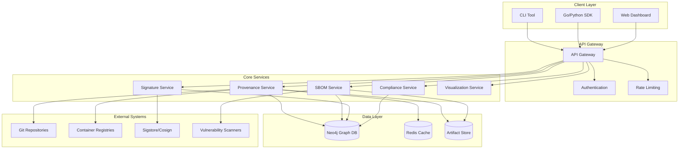
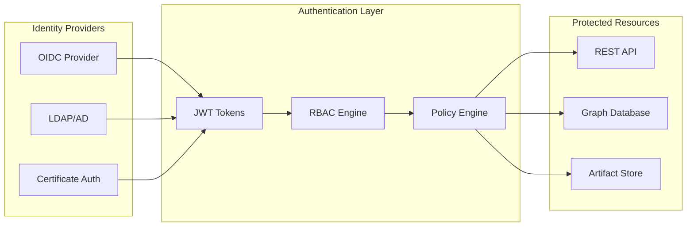
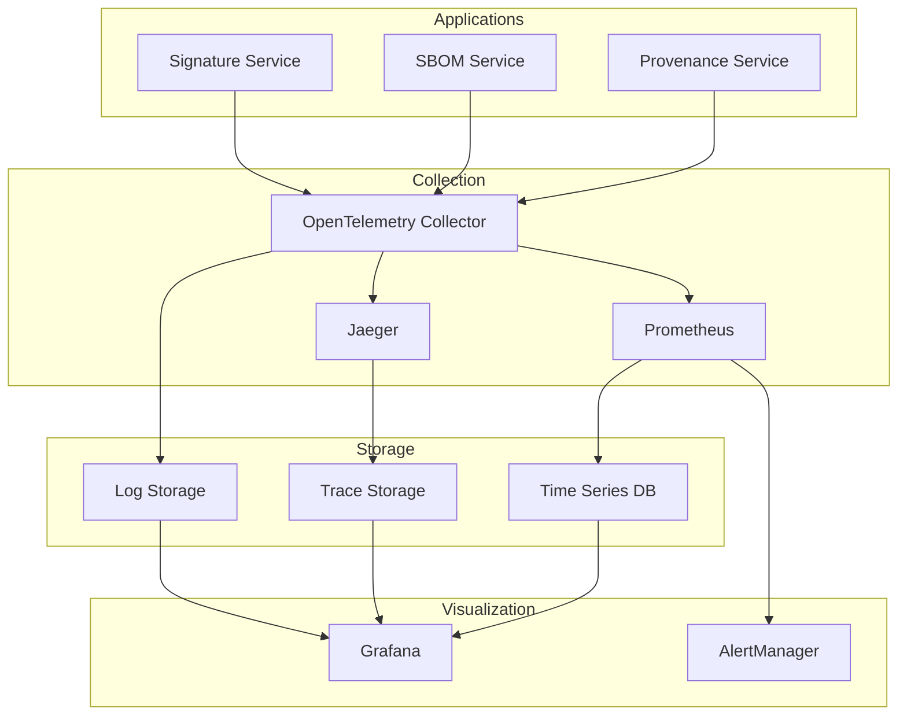

# System Architecture

## Overview

The Provenance Graph SBOM Linker implements a microservices architecture designed for scalability, security, and compliance. The system tracks software supply chain provenance from source code to production deployment using a graph-based approach.

## Architecture Principles

1. **Zero Trust Security**: Every artifact must be cryptographically verified
2. **Immutable Provenance**: Once recorded, provenance data cannot be modified
3. **Event-Driven Architecture**: Asynchronous processing for scalability
4. **Graph-First Design**: Relationships are first-class citizens
5. **API-First Development**: All functionality exposed via REST API
6. **Cloud-Native**: Designed for containerized, Kubernetes-native deployment

## System Components

### Core Services



### Service Descriptions

#### Provenance Service
- **Purpose**: Core provenance tracking and graph construction
- **Responsibilities**:
  - Collect provenance data from various sources
  - Build and maintain the provenance graph
  - Track relationships between artifacts
  - Handle build event processing
- **Technology**: Go, gRPC, Neo4j driver
- **Scaling**: Horizontal with load balancing

#### SBOM Service
- **Purpose**: Software Bill of Materials processing
- **Responsibilities**:
  - Parse SBOM files (CycloneDX, SPDX, Syft)
  - Extract dependency information
  - Link dependencies to provenance graph
  - Vulnerability correlation
- **Technology**: Go, JSON/XML parsers
- **Scaling**: Worker pool pattern

#### Signature Service
- **Purpose**: Cryptographic verification and attestation
- **Responsibilities**:
  - Verify artifact signatures
  - Generate attestations
  - Manage public key infrastructure
  - SLSA provenance validation
- **Technology**: Go, Cosign, Sigstore
- **Scaling**: Stateless horizontal scaling

#### Compliance Service
- **Purpose**: Generate compliance reports and assessments
- **Responsibilities**:
  - NIST SSDF compliance checking
  - EU CRA report generation
  - Custom framework support
  - Policy enforcement
- **Technology**: Go, template engines
- **Scaling**: Batch processing workers

#### Visualization Service
- **Purpose**: Graph visualization and dashboard rendering
- **Responsibilities**:
  - Generate interactive graph visualizations
  - Create compliance dashboards
  - Export reports in various formats
  - Real-time metrics display
- **Technology**: Go, D3.js, Chart.js
- **Scaling**: CDN for static assets

## Data Architecture

### Graph Database Schema

```cypher
// Node Types
(:Source {type: "git", url: string, commit: string})
(:Build {id: string, system: string, timestamp: datetime})
(:Artifact {name: string, version: string, type: string, hash: string})
(:SBOM {format: string, version: string, hash: string})
(:Vulnerability {cve: string, severity: string, score: float})
(:Deployment {environment: string, platform: string, timestamp: datetime})
(:Signature {algorithm: string, public_key: string, timestamp: datetime})

// Relationship Types
(:Source)-[:BUILT_INTO]->(:Build)
(:Build)-[:PRODUCES]->(:Artifact)
(:Artifact)-[:HAS_SBOM]->(:SBOM)
(:SBOM)-[:CONTAINS]->(:Dependency)
(:Dependency)-[:VULNERABLE_TO]->(:Vulnerability)
(:Artifact)-[:SIGNED_BY]->(:Signature)
(:Artifact)-[:DEPLOYED_TO]->(:Deployment)
```

### Data Flow

1. **Ingestion**: Events from CI/CD systems, registries, and scanners
2. **Processing**: Parse, validate, and enrich incoming data
3. **Storage**: Store in graph database with relationships
4. **Query**: Traverse graph for provenance queries
5. **Export**: Generate reports and visualizations

## Security Architecture

### Authentication and Authorization



### Security Controls

1. **Transport Security**: TLS 1.3 for all communications
2. **Data Encryption**: AES-256 encryption at rest
3. **Access Control**: Role-based access control (RBAC)
4. **Audit Logging**: Comprehensive audit trail
5. **Secrets Management**: External secret stores (Vault, K8s secrets)
6. **Network Security**: Network policies and service mesh

## Deployment Architecture

### Kubernetes Deployment

```yaml
apiVersion: v1
kind: Namespace
metadata:
  name: provenance-system
  labels:
    security.istio.io/tlsMode: istio
---
apiVersion: apps/v1
kind: Deployment
metadata:
  name: provenance-service
spec:
  replicas: 3
  selector:
    matchLabels:
      app: provenance-service
  template:
    spec:
      containers:
      - name: provenance-service
        image: provenance-linker/service:latest
        ports:
        - containerPort: 8080
        env:
        - name: NEO4J_URI
          valueFrom:
            secretKeyRef:
              name: database-credentials
              key: neo4j-uri
        resources:
          requests:
            memory: "512Mi"
            cpu: "250m"
          limits:
            memory: "1Gi"
            cpu: "500m"
        livenessProbe:
          httpGet:
            path: /health
            port: 8080
          initialDelaySeconds: 30
          periodSeconds: 10
        readinessProbe:
          httpGet:
            path: /ready
            port: 8080
          initialDelaySeconds: 5
          periodSeconds: 5
```

### High Availability Configuration

- **Database**: Neo4j cluster with 3 core nodes and 2 read replicas
- **Services**: Minimum 3 replicas per service with anti-affinity rules
- **Load Balancing**: Istio service mesh with circuit breakers
- **Caching**: Redis Sentinel cluster for high availability
- **Storage**: Distributed object storage with replication

## Scalability Design

### Horizontal Scaling

1. **Stateless Services**: All services are stateless for easy scaling
2. **Database Sharding**: Graph partitioning by artifact namespace
3. **Caching Strategy**: Multi-level caching (Redis, application-level)
4. **Load Balancing**: Intelligent routing based on service health
5. **Auto-scaling**: Kubernetes HPA based on CPU/memory/custom metrics

### Performance Optimizations

1. **Graph Indexing**: Strategic indexes on frequently queried properties
2. **Query Optimization**: Cached queries and materialized views
3. **Bulk Operations**: Batch processing for large data sets
4. **Connection Pooling**: Efficient database connection management
5. **CDN Integration**: Static asset delivery via CDN

## Monitoring and Observability

### Observability Stack



### Key Metrics

- **Business Metrics**: Provenance coverage, compliance scores
- **Technical Metrics**: Latency, throughput, error rates
- **Infrastructure Metrics**: CPU, memory, disk, network
- **Security Metrics**: Failed authentications, signature failures

## Disaster Recovery

### Backup Strategy

1. **Graph Database**: Daily full backups, hourly incremental
2. **Artifact Store**: Geo-replicated storage with versioning
3. **Configuration**: GitOps approach with infrastructure as code
4. **Secrets**: Encrypted backups with key rotation

### Recovery Procedures

1. **RTO (Recovery Time Objective)**: 4 hours
2. **RPO (Recovery Point Objective)**: 1 hour
3. **Automated Failover**: Cross-region deployment capabilities
4. **Data Validation**: Integrity checks after recovery

## Future Architecture Considerations

### Planned Enhancements

1. **Multi-Cloud Support**: Deployment across multiple cloud providers
2. **Edge Computing**: Local provenance tracking at edge locations
3. **Blockchain Integration**: Immutable audit trail via blockchain
4. **AI/ML Enhancement**: Automated anomaly detection in provenance
5. **Federation**: Cross-organization provenance sharing

### Technology Evolution

1. **Database**: Evaluate graph databases (ArangoDB, TigerGraph)
2. **Messaging**: Consider event streaming (Apache Kafka)
3. **ML Pipeline**: MLOps integration for model provenance
4. **Zero-Knowledge**: Privacy-preserving provenance verification