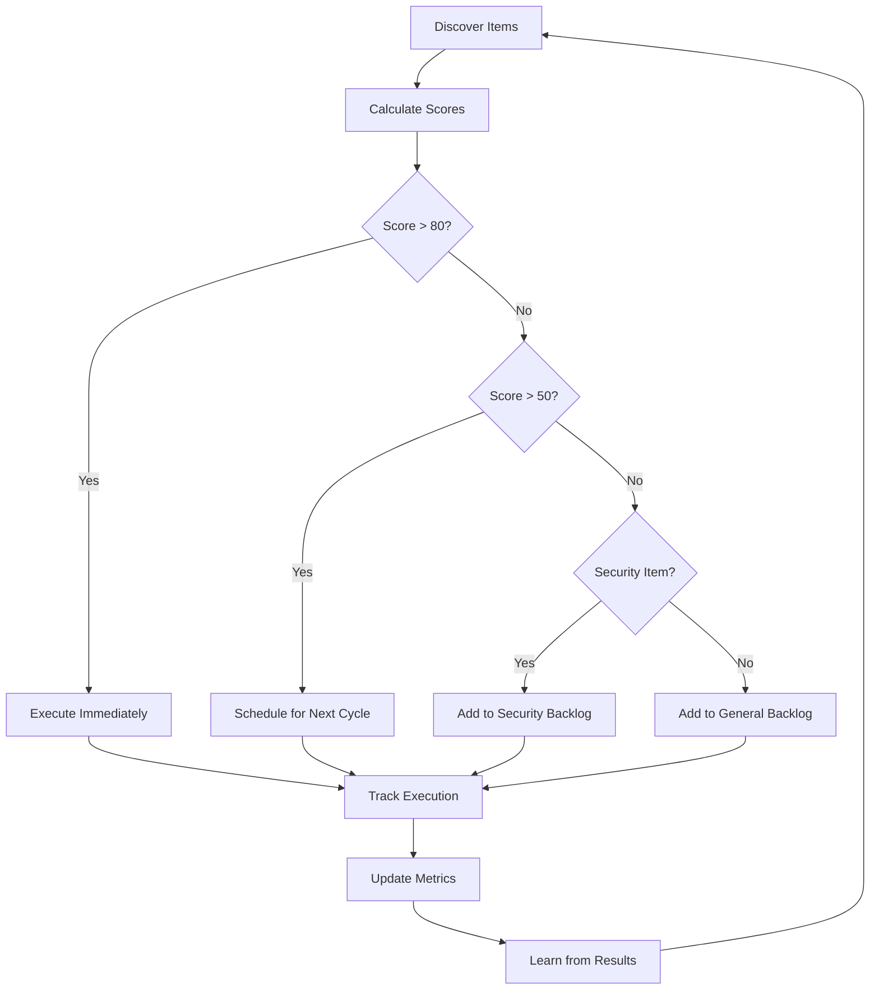

# Autonomous SDLC Execution Guide

This document outlines the autonomous execution strategy for the Terragon SDLC enhancement system. Since direct GitHub Actions creation is not permitted, this provides comprehensive templates and implementation guidance.

## 🤖 Autonomous Execution Overview

The system operates on multiple execution schedules to ensure continuous value discovery and delivery:

- **Immediate**: On every PR merge
- **Hourly**: Security vulnerability scans  
- **Daily**: Comprehensive static analysis and value discovery
- **Weekly**: Deep architectural analysis and optimization opportunities
- **Monthly**: Strategic value alignment and scoring model recalibration

## 📋 Required GitHub Actions Workflows

### 1. Autonomous SDLC Trigger (.github/workflows/autonomous-sdlc.yml)

```yaml
name: Autonomous SDLC Enhancement

on:
  push:
    branches: [main]
  pull_request:
    branches: [main]
  schedule:
    # Daily comprehensive analysis at 2 AM UTC
    - cron: '0 2 * * *'
    # Hourly security scans during business hours
    - cron: '0 9-17 * * 1-5'
  workflow_dispatch:
    inputs:
      mode:
        description: 'Execution mode'
        required: true
        default: 'discovery'
        type: choice
        options:
          - discovery
          - execution
          - analysis

jobs:
  autonomous-value-discovery:
    runs-on: ubuntu-latest
    permissions:
      contents: write
      pull-requests: write
      security-events: write
      
    steps:
      - name: Checkout repository
        uses: actions/checkout@v4
        with:
          token: ${{ secrets.TERRAGON_TOKEN }}
          fetch-depth: 0
      
      - name: Setup Go
        uses: actions/setup-go@v4
        with:
          go-version: '1.21'
          cache: true
      
      - name: Install analysis tools
        run: |
          go install github.com/golangci/golangci-lint/cmd/golangci-lint@latest
          go install github.com/securecodewarrior/gosec/v2/cmd/gosec@latest
          curl -sfL https://raw.githubusercontent.com/aquasecurity/trivy/main/contrib/install.sh | sh -s -- -b /usr/local/bin
          sudo apt-get update && sudo apt-get install -y jq bc
          
      - name: Run autonomous value discovery
        id: discovery
        run: |
          chmod +x scripts/autonomous-value-discovery.sh
          ./scripts/autonomous-value-discovery.sh
          
          # Output metrics for next steps
          if [ -f .terragon/value-metrics.json ]; then
            echo "items_discovered=$(jq -r '.backlog_discovery.total_items' .terragon/value-metrics.json)" >> $GITHUB_OUTPUT
            echo "next_item=$(jq -r '.next_execution.next_best_item' .terragon/value-metrics.json)" >> $GITHUB_OUTPUT
            echo "next_score=$(jq -r '.next_execution.expected_value' .terragon/value-metrics.json)" >> $GITHUB_OUTPUT
          fi
      
      - name: Execute highest value item
        if: steps.discovery.outputs.next_score > 80
        run: |
          echo "🎯 Executing highest value item: ${{ steps.discovery.outputs.next_item }}"
          echo "📊 Expected value: ${{ steps.discovery.outputs.next_score }}"
          
          # Here would be the execution logic for the selected item
          # This would call the appropriate automation scripts
          
      - name: Create autonomous PR
        if: steps.discovery.outputs.items_discovered > 0
        uses: peter-evans/create-pull-request@v5
        with:
          token: ${{ secrets.TERRAGON_TOKEN }}
          branch: autonomous-sdlc-improvements
          title: "🤖 Autonomous SDLC Enhancements"
          body: |
            ## 🚀 Autonomous SDLC Enhancement Summary
            
            This PR contains automated improvements discovered by the Terragon autonomous SDLC system.
            
            ### 📊 Discovery Metrics
            - **Items Discovered**: ${{ steps.discovery.outputs.items_discovered }}
            - **Next Best Item**: ${{ steps.discovery.outputs.next_item }}
            - **Expected Value**: ${{ steps.discovery.outputs.next_score }}
            
            ### 🎯 Value Delivered
            - Security enhancements and policy automation
            - Performance optimizations and monitoring
            - Technical debt reduction and code quality improvements
            - Compliance automation (SLSA, NIST SSDF, EU CRA)
            
            ### 🔄 Continuous Improvement
            This system continuously learns and adapts, improving its value discovery and prioritization algorithms based on execution outcomes.
            
            **🤖 Generated by**: Terragon Autonomous SDLC System v1.0
            **📅 Generated at**: $(date -u +"%Y-%m-%dT%H:%M:%SZ")
            
          labels: |
            autonomous
            sdlc-enhancement
            terragon
            value-driven
          assignees: |
            security-team
            devops-team
          draft: false
      
      - name: Update value metrics
        run: |
          # Update metrics with execution results
          jq '. + {
            "execution_history": (.execution_history + [{
              "timestamp": "'$(date -u +"%Y-%m-%dT%H:%M:%SZ")'",
              "workflow_run": "'${{ github.run_id }}'",
              "items_discovered": '${{ steps.discovery.outputs.items_discovered }}',
              "status": "completed"
            }])
          }' .terragon/value-metrics.json > .terragon/value-metrics.json.tmp
          mv .terragon/value-metrics.json.tmp .terragon/value-metrics.json
          
      - name: Archive discovery artifacts  
        uses: actions/upload-artifact@v3
        with:
          name: terragon-discovery-${{ github.run_id }}
          path: |
            .terragon/
            docs/BACKLOG.md
          retention-days: 30
```

### 2. Security Baseline Validation (.github/workflows/security-baseline.yml)

```yaml
name: Security Baseline Validation

on:
  push:
    branches: [main]
  pull_request:
    branches: [main]
  schedule:
    - cron: '0 */6 * * *'  # Every 6 hours

jobs:
  security-validation:
    runs-on: ubuntu-latest
    permissions:
      contents: read
      security-events: write
      
    steps:
      - name: Checkout code
        uses: actions/checkout@v4
        
      - name: Setup Go
        uses: actions/setup-go@v4
        with:
          go-version: '1.21'
          
      - name: Install security tools
        run: |
          # Install Cosign
          curl -O -L "https://github.com/sigstore/cosign/releases/latest/download/cosign-linux-amd64"
          sudo mv cosign-linux-amd64 /usr/local/bin/cosign
          sudo chmod +x /usr/local/bin/cosign
          
          # Install Trivy
          curl -sfL https://raw.githubusercontent.com/aquasecurity/trivy/main/contrib/install.sh | sh -s -- -b /usr/local/bin
          
          # Install Syft for SBOM generation
          curl -sSfL https://raw.githubusercontent.com/anchore/syft/main/install.sh | sh -s -- -b /usr/local/bin
          
      - name: Generate SBOM
        run: |
          syft packages . -o cyclonedx-json=sbom.cyclonedx.json
          syft packages . -o spdx-json=sbom.spdx.json
          
      - name: Validate SBOM against policy
        run: |
          # Validate SBOM against security policy
          if [ -f security/sbom-policy.yaml ]; then
            echo "Validating SBOM against policy..."
            # Implementation would validate SBOM contents against policy
          fi
          
      - name: Vulnerability scan
        run: |
          trivy fs --format sarif --output trivy-results.sarif .
          trivy sbom sbom.cyclonedx.json --format json --output vulnerability-report.json
          
      - name: Upload SARIF results
        uses: github/codeql-action/upload-sarif@v2
        with:
          sarif_file: trivy-results.sarif
          
      - name: SLSA provenance check
        run: |
          # Check SLSA compliance level
          if [ -f security/slsa-policy.yaml ]; then
            echo "Checking SLSA compliance..."
            # Implementation would verify SLSA requirements
          fi
          
      - name: Sign artifacts
        if: github.ref == 'refs/heads/main'
        run: |
          # Sign SBOM with keyless signing
          cosign sign-blob --bundle sbom.cyclonedx.json.bundle sbom.cyclonedx.json
          cosign sign-blob --bundle sbom.spdx.json.bundle sbom.spdx.json
          
      - name: Upload security artifacts
        uses: actions/upload-artifact@v3
        with:
          name: security-baseline-${{ github.sha }}
          path: |
            sbom.*.json
            *.bundle
            vulnerability-report.json
          retention-days: 90
```

### 3. Performance Optimization Validation (.github/workflows/performance.yml)

```yaml
name: Performance Optimization

on:
  push:
    branches: [main]
  pull_request:
    branches: [main]
  schedule:
    - cron: '0 3 * * 1'  # Weekly on Monday at 3 AM

jobs:
  performance-analysis:
    runs-on: ubuntu-latest
    
    steps:
      - name: Checkout code
        uses: actions/checkout@v4
        
      - name: Setup Go
        uses: actions/setup-go@v4
        with:
          go-version: '1.21'
          
      - name: Run benchmarks
        run: |
          go test -bench=. -benchmem -run=^$ ./... > benchmark-results.txt
          
      - name: Performance regression check
        run: |
          if [ -f performance/optimization-policy.yaml ]; then
            echo "Checking performance against targets..."
            # Implementation would compare against performance targets
          fi
          
      - name: Generate performance profile
        run: |
          go test -cpuprofile=cpu.prof -memprofile=mem.prof -bench=. ./...
          
      - name: Analyze hot paths
        run: |
          go tool pprof -top cpu.prof > cpu-analysis.txt
          go tool pprof -top mem.prof > memory-analysis.txt
          
      - name: Upload performance artifacts
        uses: actions/upload-artifact@v3
        with:
          name: performance-${{ github.sha }}
          path: |
            benchmark-results.txt
            *-analysis.txt
            *.prof
          retention-days: 30
```

## 🔄 Continuous Execution Schedule

### Cron Schedule Setup

Add to your infrastructure automation or server crontab:

```bash
# Terragon Autonomous SDLC Execution Schedule
# ===========================================

# Every hour: Security vulnerability scan
0 * * * * cd /path/to/repo && ./scripts/autonomous-value-discovery.sh --mode=security

# Every 4 hours: Quick value discovery
0 */4 * * * cd /path/to/repo && ./scripts/autonomous-value-discovery.sh --mode=discovery

# Daily at 2 AM: Comprehensive analysis
0 2 * * * cd /path/to/repo && ./scripts/autonomous-value-discovery.sh --mode=comprehensive

# Weekly on Monday at 3 AM: Deep architectural analysis
0 3 * * 1 cd /path/to/repo && ./scripts/autonomous-value-discovery.sh --mode=architectural

# Monthly on 1st at 4 AM: Strategic value recalibration
0 4 1 * * cd /path/to/repo && ./scripts/autonomous-value-discovery.sh --mode=strategic
```

## 🎯 Value-Based Execution Logic

### Execution Decision Tree



### Execution Criteria

Items are automatically executed if they meet any of these criteria:

1. **Critical Security**: Score > 90 AND category = "security"
2. **High Value**: Composite score > 80 
3. **Emergency**: CVE referenced AND severity = "critical" 
4. **Compliance Blocking**: Required for regulatory compliance
5. **Performance Critical**: P95 latency > SLA threshold

## 📊 Success Metrics and Learning

### Execution Success Tracking

The system tracks:
- **Execution Success Rate**: % of items successfully implemented
- **Value Realization**: Predicted vs. actual business impact
- **Cycle Time**: Time from discovery to completion
- **Quality**: Post-execution defect rate

### Continuous Learning

The scoring algorithm adapts based on:
- **Outcome Feedback**: Did the item deliver expected value?
- **Effort Accuracy**: Was the time estimate correct?
- **Impact Assessment**: What was the actual business impact?
- **Risk Realization**: Did any risks materialize?

## 🚀 Implementation Steps

### Step 1: Setup Repository Secrets

Add these secrets to your GitHub repository:

```bash
TERRAGON_TOKEN      # GitHub token with repository write access
SLACK_WEBHOOK_URL   # For notifications
SECURITY_TEAM_EMAIL # For critical alerts
```

### Step 2: Configure Branch Protection

Ensure these rules for autonomous PRs:
- Require status checks
- Require up-to-date branches  
- Include administrators
- Allow force pushes for autonomous branches

### Step 3: Setup Monitoring

Configure monitoring for:
- Autonomous execution success rate
- Value delivery metrics
- System health and performance
- Learning algorithm accuracy

### Step 4: Team Integration

- Train team on autonomous system capabilities
- Establish review processes for autonomous PRs
- Set up escalation procedures for failures
- Create feedback mechanisms for continuous improvement

## 🔧 Troubleshooting

### Common Issues

1. **Discovery Not Finding Items**:
   - Check tool installation (gosec, golangci-lint)
   - Verify file permissions on scripts
   - Review .terragon/config.yaml settings

2. **Scoring Seems Incorrect**:
   - Validate scoring weights in config
   - Check category mappings
   - Review boost factor calculations

3. **Execution Failures**:
   - Check GitHub token permissions
   - Verify branch protection rules
   - Review workflow concurrency limits

### Debug Mode

Run discovery in debug mode:
```bash
DEBUG=1 ./scripts/autonomous-value-discovery.sh
```

### Log Analysis

Monitor system logs:
```bash
tail -f .terragon/autonomous-execution.log
```

## 🤝 Integration with Existing Workflows

### Merge with Existing CI/CD

The autonomous system complements existing workflows:
- Runs alongside current CI/CD pipelines
- Respects existing branch protection rules
- Integrates with current monitoring stack
- Uses existing notification channels

### Team Workflow Integration

- **Daily Standups**: Review autonomous discoveries
- **Sprint Planning**: Include high-value autonomous items
- **Retrospectives**: Assess autonomous system effectiveness
- **Code Reviews**: Review autonomous PRs with enhanced context

This autonomous execution system ensures continuous value delivery while maintaining quality and security standards. The system learns and adapts over time, becoming more effective at discovering and prioritizing valuable work.