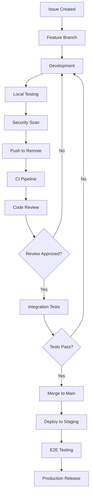

# Development Workflows for Provenance Graph SBOM Linker

## Overview

This document defines the comprehensive development workflows for the supply chain security platform, including contribution guidelines, review processes, and quality assurance procedures.

## Table of Contents

1. [Development Lifecycle](#development-lifecycle)
2. [Branch Strategy](#branch-strategy)
3. [Code Review Process](#code-review-process)
4. [Testing Workflows](#testing-workflows)
5. [Security Review Process](#security-review-process)
6. [Release Management](#release-management)
7. [Incident Response](#incident-response)

---

## Development Lifecycle

### Feature Development Flow



### Development Environment Setup

1. **Prerequisites Check**
   ```bash
   # Clone repository
   git clone https://github.com/danieleschmidt/provenance-graph-sbom-linker.git
   cd provenance-graph-sbom-linker
   
   # Setup development environment
   make setup
   make dev
   
   # Verify setup
   make check-tools
   ```

2. **Development Container** (Recommended)
   ```bash
   # Use devcontainer for consistent environment
   code . # Opens in VS Code with devcontainer
   
   # Or manually
   docker-compose -f docker-compose.dev.yml up -d
   ```

3. **Pre-commit Hooks Setup**
   ```bash
   # Install pre-commit hooks
   pre-commit install
   pre-commit install --hook-type commit-msg
   
   # Test hooks
   pre-commit run --all-files
   ```

---

## Branch Strategy

### GitFlow-Based Strategy

- **main**: Production-ready code
- **develop**: Integration branch for features
- **feature/***: Feature development branches
- **release/***: Release preparation branches
- **hotfix/***: Critical production fixes
- **security/***: Security-related changes

### Branch Naming Conventions

```
feature/USER-123-implement-sbom-scanning
bugfix/USER-456-fix-signature-verification
security/USER-789-patch-vulnerability
hotfix/USER-101-critical-memory-leak
release/v1.2.0
```

### Branch Protection Rules

**Main Branch**:
- Require pull request reviews (2 reviewers)
- Require status checks to pass
- Require branches to be up to date
- Restrict pushes to main
- Include administrators in restrictions

**Develop Branch**:
- Require pull request reviews (1 reviewer)
- Require status checks to pass
- Allow squash merging

---

## Code Review Process

### Review Checklist Template

#### Functionality Review
- [ ] Code implements the intended functionality
- [ ] Edge cases are handled appropriately
- [ ] Error handling is comprehensive
- [ ] Performance considerations are addressed

#### Security Review
- [ ] No hardcoded secrets or credentials
- [ ] Input validation is implemented
- [ ] Authentication/authorization is proper
- [ ] No SQL injection vulnerabilities
- [ ] Cryptographic operations are secure

#### Code Quality Review
- [ ] Code follows project style guidelines
- [ ] Functions are well-documented
- [ ] Complex logic is commented
- [ ] No code duplication
- [ ] Proper error messages

#### Testing Review
- [ ] Unit tests cover new functionality
- [ ] Integration tests are included where needed
- [ ] Test coverage meets requirements (>85%)
- [ ] Tests follow naming conventions

### Review Assignment Matrix

| Type | Primary Reviewer | Secondary Reviewer | Security Review |
|------|-----------------|-------------------|-----------------|
| Feature | Team Member | Tech Lead | Security Team |
| Security | Security Team | Architecture Team | CISO |
| Infrastructure | Platform Team | Tech Lead | Security Team |
| Documentation | Technical Writer | Subject Expert | N/A |

### Review Response Times

- **Critical**: 4 hours
- **High**: 24 hours
- **Medium**: 48 hours
- **Low**: 1 week

---

## Testing Workflows

### Test Pyramid Strategy

```
        /\
       /  \
      / E2E \ (5%)
     /______\
    /        \
   /Integration\ (25%)
  /_____________\
 /               \
/     Unit Tests   \ (70%)
\___________________/
```

### Test Execution Matrix

| Test Type | Trigger | Environment | Duration | Coverage |
|-----------|---------|-------------|----------|----------|
| Unit | Every commit | Local/CI | <5 min | >85% |
| Integration | PR creation | CI | <15 min | >80% |
| E2E | Pre-merge | Staging | <30 min | Critical paths |
| Performance | Release branch | Performance env | <60 min | Key scenarios |
| Security | Every push | CI | <10 min | All components |

### Test Data Management

```bash
# Generate test data
make generate-test-data

# Seed test database
make db-seed-test

# Clean test environment
make clean-test-env
```

### Quality Gates

1. **Code Coverage**: Minimum 85% overall, 95% for security modules
2. **Performance**: No regression > 10% in critical paths
3. **Security**: Zero high/critical vulnerabilities
4. **Compliance**: All policy checks pass

---

## Security Review Process

### Security Review Triggers

- Changes to authentication/authorization
- Cryptographic operations
- External API integrations
- Data handling modifications
- Infrastructure changes

### Security Review Checklist

#### Authentication & Authorization
- [ ] Authentication mechanisms are robust
- [ ] Authorization checks are comprehensive
- [ ] Session management is secure
- [ ] Multi-factor authentication support

#### Data Protection
- [ ] Sensitive data is encrypted at rest
- [ ] Data in transit is encrypted
- [ ] PII handling follows privacy policies
- [ ] Data retention policies are enforced

#### Input Validation
- [ ] All inputs are validated and sanitized
- [ ] SQL injection prevention
- [ ] XSS protection mechanisms
- [ ] Command injection prevention

#### Infrastructure Security
- [ ] Container images are scanned
- [ ] Dependencies are up to date
- [ ] Network policies are enforced
- [ ] Secrets management is proper

#### Supply Chain Security
- [ ] SBOM generation is accurate
- [ ] Signature verification is implemented
- [ ] Provenance tracking is complete
- [ ] Vulnerability scanning is comprehensive

### Security Toolchain Integration

```yaml
# Security scanning in CI pipeline
security_checks:
  - static_analysis: gosec, semgrep
  - dependency_scan: trivy, grype
  - container_scan: trivy, clair
  - secrets_scan: truffleHog, detect-secrets
  - license_scan: fossa, licensefinder
```

---

## Release Management

### Release Types

1. **Major Release** (x.0.0): Breaking changes, new features
2. **Minor Release** (x.y.0): New features, backward compatible
3. **Patch Release** (x.y.z): Bug fixes, security patches
4. **Hotfix Release**: Critical production fixes

### Release Checklist

#### Pre-Release
- [ ] All features completed and tested
- [ ] Security review completed
- [ ] Performance benchmarks met
- [ ] Documentation updated
- [ ] Change log prepared

#### Release Process
- [ ] Create release branch
- [ ] Run full test suite
- [ ] Update version numbers
- [ ] Generate SBOM
- [ ] Sign release artifacts
- [ ] Create GitHub release
- [ ] Deploy to production

#### Post-Release
- [ ] Monitor deployment metrics
- [ ] Verify functionality in production
- [ ] Update monitoring dashboards
- [ ] Communicate release to stakeholders

### Semantic Versioning

```
MAJOR.MINOR.PATCH-PRERELEASE+BUILD

Examples:
1.0.0          - Initial release
1.1.0          - New features
1.1.1          - Bug fixes
2.0.0-beta.1   - Pre-release
2.0.0+20231201 - Build metadata
```

### Release Artifact Requirements

- Signed binaries with GPG/Cosign
- SBOM in CycloneDX and SPDX formats
- Security scan reports
- Vulnerability assessment
- License compliance report

---

## Incident Response

### Incident Classification

- **P0**: Service completely down, security breach
- **P1**: Major functionality affected, limited service
- **P2**: Minor functionality affected, degraded service
- **P3**: Minor issues, no service impact

### Response Timeline

| Priority | Initial Response | Status Update | Resolution Target |
|----------|------------------|---------------|-------------------|
| P0 | 15 minutes | Every 30 min | 4 hours |
| P1 | 1 hour | Every 2 hours | 24 hours |
| P2 | 4 hours | Daily | 1 week |
| P3 | 1 business day | Weekly | 1 month |

### Hotfix Process

1. **Assessment**: Evaluate incident severity and impact
2. **Branch Creation**: Create hotfix branch from main
3. **Development**: Implement minimal fix
4. **Testing**: Accelerated testing for hotfix
5. **Review**: Emergency review process
6. **Deployment**: Direct to production
7. **Post-mortem**: Conduct incident review

### Communication Plan

```
Incident Declared
       ↓
Internal Team Alert (Slack #incidents)
       ↓
Management Notification (15 min for P0/P1)
       ↓
Customer Communication (1 hour for P0, 4 hours for P1)
       ↓
Regular Status Updates
       ↓
Resolution Communication
       ↓
Post-mortem Report (48 hours)
```

---

## Workflow Automation

### GitHub Actions Integration

```yaml
# Example workflow trigger
on:
  pull_request:
    types: [opened, synchronize, reopened]
  push:
    branches: [main, develop]
  schedule:
    - cron: '0 2 * * *'  # Daily security scans
```

### Required Workflows

1. **ci.yml**: Continuous integration pipeline
2. **security.yml**: Security scanning and compliance
3. **release.yml**: Automated release process
4. **performance.yml**: Performance testing
5. **dependency-update.yml**: Automated dependency updates

### Workflow Templates

Templates are available in `.github/workflows/templates/` for:
- Feature development workflow
- Security patch workflow
- Performance testing workflow
- Documentation update workflow

---

## Metrics and Monitoring

### Development Metrics

- **Lead Time**: Commit to production deployment
- **Deployment Frequency**: How often releases occur
- **Mean Time to Recovery**: Time to resolve incidents
- **Change Failure Rate**: Percentage of failed deployments

### Quality Metrics

- **Code Coverage**: Percentage of code covered by tests
- **Technical Debt**: SonarQube debt ratio
- **Security Issues**: Number of vulnerabilities
- **Performance**: Response time and throughput

### Process Metrics

- **Review Time**: Time from PR creation to approval
- **Build Success Rate**: Percentage of successful builds
- **Test Reliability**: Flaky test percentage
- **Documentation Coverage**: API and code documentation

---

## Best Practices

### Development Best Practices

1. **Small, Focused Commits**: Each commit should represent a single logical change
2. **Descriptive Commit Messages**: Follow conventional commits format
3. **Regular Integration**: Merge frequently to avoid conflicts
4. **Test-Driven Development**: Write tests before implementation
5. **Documentation**: Update docs with code changes

### Security Best Practices

1. **Least Privilege**: Grant minimum necessary permissions
2. **Defense in Depth**: Multiple layers of security controls
3. **Regular Updates**: Keep dependencies and tools updated
4. **Secure by Default**: Default configurations should be secure
5. **Audit Trail**: Maintain logs of all security-relevant actions

### Collaboration Best Practices

1. **Clear Communication**: Use descriptive PR titles and descriptions
2. **Constructive Feedback**: Focus on code, not person
3. **Knowledge Sharing**: Document decisions and rationale
4. **Inclusive Reviews**: Consider different perspectives
5. **Continuous Learning**: Share learnings and best practices

---

## Tools and Resources

### Development Tools
- **IDE**: VS Code with devcontainer support
- **Version Control**: Git with GPG signing
- **Testing**: Go test framework, Testify
- **Documentation**: Markdown, Swagger/OpenAPI

### Security Tools
- **SAST**: Gosec, Semgrep
- **DAST**: OWASP ZAP
- **SCA**: Trivy, Grype
- **Secrets**: TruffleHog, detect-secrets

### Monitoring Tools
- **Metrics**: Prometheus, Grafana
- **Logging**: ELK Stack, Loki
- **Tracing**: Jaeger, OpenTelemetry
- **Alerting**: AlertManager, PagerDuty

### Communication Tools
- **Chat**: Slack (#development, #security, #incidents)
- **Documentation**: Confluence, GitHub Wiki
- **Project Management**: GitHub Projects, Jira
- **Knowledge Base**: Internal wiki, runbooks

---

## Getting Help

### Internal Resources
- **Development Team**: @dev-team in Slack
- **Security Team**: @security-team in Slack
- **Platform Team**: @platform-team in Slack
- **On-call Engineer**: Use PagerDuty for urgent issues

### External Resources
- [Go Documentation](https://golang.org/doc/)
- [Docker Best Practices](https://docs.docker.com/develop/dev-best-practices/)
- [Kubernetes Documentation](https://kubernetes.io/docs/)
- [OWASP Security Guidelines](https://owasp.org/)

### Training and Certification
- **Security Training**: Annual security awareness training
- **Go Certification**: Google Cloud certification program
- **DevOps Training**: Platform engineering best practices
- **Incident Response**: Crisis management training